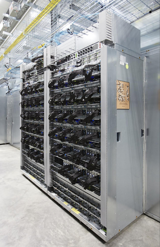
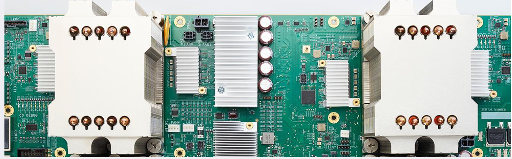
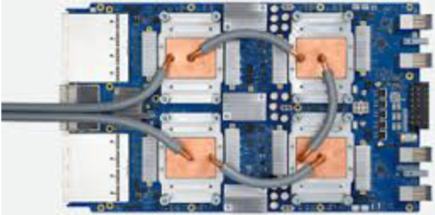

# google最新的tpu架构信息
> 补充从2021年至今的google tpu系列的各个型号和特点

## 历史架构
google tpu自2016年开始设计第一个版本TPU-v1，到2021年广为人知的TPU-v4系列的架构演进可以参考ZOMI老师的文章[1](#ref-1)，Patterson教授还专为此写了一篇从2016至2021年间TPU的演进介绍[2](#ref-2)。如有读者对TPU架构的提出以及之后的发展感兴趣，欢迎参考我的另一篇文章[从CPU,GPU和TPU](From-CPU-GPU-to-TPU.md)。

### TPUv1
在TPUv1的论文中提到“在数据中心环境中，以显著改善TCO[4](#ref-4)，来降低神经网络的推理成本。” 因此TPU在设计之初就考虑到芯片的大规模部署和高效能计算，同时为了简化硬件设计和快速部署，TPU选择为利用PCIe/IO的总线架构，像GPU一样作为加速卡插入服务器中[3](#ref-3).更简单地说，类似于一个“外挂单片机”。

下图是TPUv1的PCB设计图和实际部署在服务器机架中的照片[5](#ref-5)：

  

### TPUv2

TPUv1是针对NN的推理而设计的，很快便暴露出瓶颈：无法支持ML的训练任务如Alex-Net，CNN0，ImageNet，和Bert这类NLP任务的训练。\
这需要更大的计算能力和存储容量以及带宽，同时由于训练任务的算法和模型需要不断调整，因此也需要可编程性更强。因此在TPUv2 [6](#ref-6)中，google采用了双核配置并使用HBM代替DDR3作为内存；在可编程性上，TPUv2使用更通用的可编程向量单元代替TPUv1硬编码功能单元，并采用了 VLIW 架构同时和XLA编译器紧密配合（XLA也是从TPUv2开始逐步发展的）。TPUv2还集成了定制的片间互连(InterChip Interconnect, ICI) [6](#ref-6)以支持大规模分布式训练并提出了pod(超级计算机)的概念沿用至今(TPUv7)。\
总体来讲，TPUv1 的设计侧重于高效的推理，而 TPUv2 则通过引入强大的专用计算单元、大幅提升的内存带宽、重塑的内存层级、更灵活的架构以及为大规模并行设计的互连，成功地转型为一款强大的ML训练芯片。这些转变在2017年完成，同年Google提出了革命性的论文“Attention is All You Need [8]”。不得不再次感叹google团队强大的工程能力和前瞻性的设计理念。

下图[7](#ref-7)是TPUv2的PCB和pod架构图：

TPUv2 boards = 4 chips  

TPUv2 pod = 256chips  

### TPUv3
TPUv3是在TPUv2的基础上进行增量式的改进，利用“边际效应”显著的提升了性能。尽管没有进行架构上的大幅变动，但是这种增量式的改进仍然需要经过精细化的分析和调整得到。
其调整主要在以下方面：
1) 加倍的矩阵乘法单元 (MXU - Matrix Multiply Unit) 数量,直接带来了max FLOPS的翻倍
2) 时钟频率从 TPUv2 的 700 MHz 提升至 TPUv3 的 940 MHz, 带来了性能上的提升
3) 提升的HBM的带宽与容量翻倍,使得 TPUv3 能够支持更大规模的模型和更大的批次(batch size)大小 
4) 增强的互连链路带宽 
5) 最大系统规模从 TPUv2 的 256 芯片扩展到了 TPUv3 的 1024 芯片
6) 从TPUv3开始采用液冷散热

通过在现有成熟设计上叠加这些优化，TPUv3 在相对较短的时间内实现了性能的大幅跃升，并且能够支持更大规模的 ML 工作负载。

下图[7](#ref-7)是TPUv2的PCB和pod架构图：\
TPUv3 boards = 4 chips  

TPUv3 pod = 1024chips   

### TPUv4i

### TPUv4
据TPUv3时隔四年后，于2022年终于发布了TPUv4的版本。尽管这段时间里Google在AI领域发表了许多重要的成果，但似乎一直没有对TPU进行更新，这导致了在2023年和2024年间，Google与NVIDIA和AMD等竞争对手的芯片性能中处于劣势，进一步导致当时其AI模型的竞争力与OpenAI，Meta等顶级AI公司拉开了差距，尽管如此，Google的AI模型Gemini仍然在之后的两年内(2024-2025)追赶上并达到世界顶级，这与其全栈自研的能力和恐怖的工程能力密不可分。

在2018年到2022年期间，AI领域发生了很大的变化，transformer架构的兴起和LLM以及diffusion模型逐渐流行。Pytorch训练框架也代替了Tensorflow成为主流框架google内部也逐步抛弃TensorFlow转向JAX。之后我将会出一篇文章专门介绍这些架构的发展史[训练框架沉浮史](../framework/Training-Framework-History.md)。除了模型架构和框架的变化，模型的参数量也发生了极大的提升，提升了大概三到四个数量级。因此，TPUv4的设计正式为了应对上面的这些变化。\
从TPUv4开始我会详细分析其芯片架构的设计并且和TPUv3([深入了解TPUv1~v3的架构转变](TPUv1~v3_revealed.md))进行对比，因为v4的设计在历代芯片中起着承上启下的作用。因此很有必要对其架构进行详尽的分析。这里我只对整体架构进行分析以保持文章的连贯性，希望深入了解TPU架构的朋友请参考专门介绍TPUv4的硬件架构细节和编程模型的文章[Google TPUv4架构详解](Google-TPUv4-Architecture-Deep-Dive.md)。

下图[9](#ref-9)是TPUv4的PCB和pod架构图：\
TPUv4 boards = 4 chips \

TPUv4 pod = 4096chips \

TPUv4
### TPUv5
> **Note:** 互联网上大部分关于TPU的架构总结止步于TPUv4，TPUv5及之后的版本信息较少，以下内容基于有限的信息进行整理，如有错误欢迎指正。

**TPUv5e**

**TPUv5p**

### TPUv6

### TPUv7

> **Concepts Explained:**
> - TCO (Total Cost of Ownership)\
是指在资产或设备的整个生命周期内，与其相关的所有直接和间接成本的总和。而在数据中心场景下，功耗与TCO高度相关，因此TPU的主要设计指标是每瓦性能(Performance per Watt)

## Reference
[1] [谷歌TPU历史发展|ZOMI](https://infrasys-ai.github.io/aisystem-docs/02Hardware05Abroad/04TPUIntrol.html)\
[2] [TPU演进十年：Google的十大经验教训](https://www.cs.ucla.edu/wp-content/uploads/cs/PATTERSON-10-Lessons-4-TPU-gens-CO2e-45-minutes.pdf)\
[3] [An in-depth look at Google's first Tensor Processing Unit (TPU)](https://cloud.google.com/blog/products/ai-machine-learning/an-in-depth-look-at-googles-first-tensor-processing-unit-tpu)\
[4] [Total Cost of Ownership - Wikipedia](https://en.wikipedia.org/wiki/Total_cost_of_ownership)\
[5] [Google supercharges machine learning tasks with custom chip](https://cloud.google.com/blog/products/ai-machine-learning/google-supercharges-machine-learning-tasks-with-custom-chip)\
[6] [The Design Process for Google’s Training Chips: TPUv2 and TPUv3](https://ieeexplore.ieee.org/stamp/stamp.jsp?tp=&arnumber=9351692)\
[7] [Google’s Training Chips Revealed: TPUv2 and TPUv3](https://www.hc32.hotchips.org/assets/program/conference/day2/HotChips2020_ML_Training_Google_Norrie_Patil.v01.pdf)\
[8] [Attention is All You Need](https://arxiv.org/abs/1706.03762) \
[9] [TPU v4: An Optically Reconfigurable Supercomputer for Machine Learning with Hardware Support for Embeddings](https://arxiv.org/pdf/2304.01433)