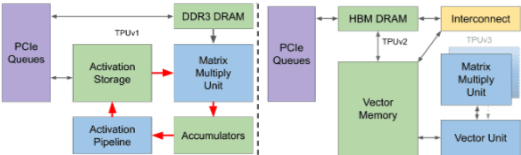
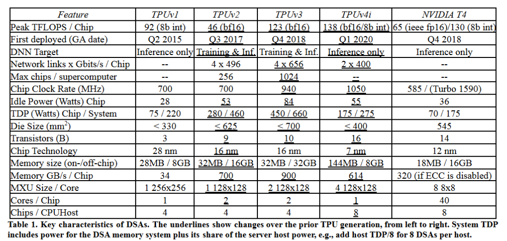
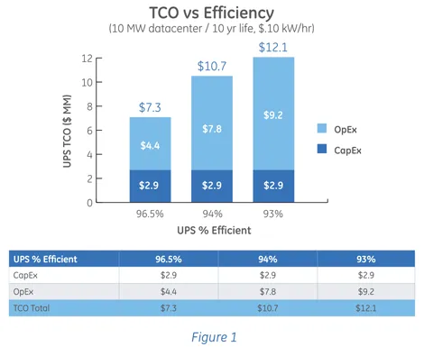
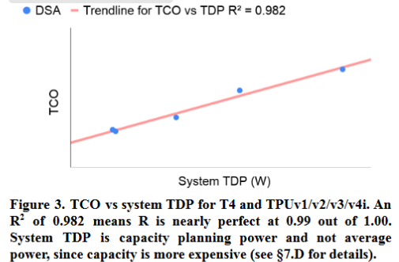
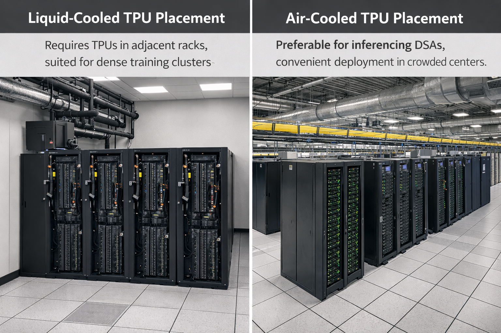
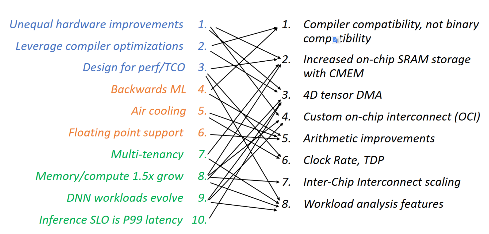
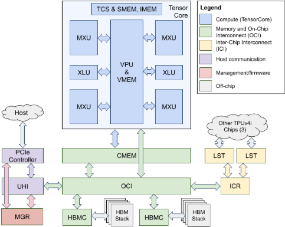
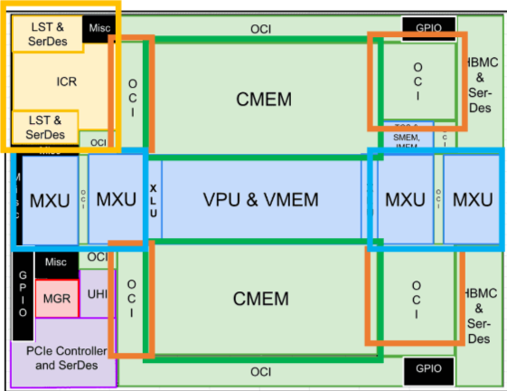

# From TPUv3 to TPUv4i

## Background
Before introducing TPUv4i (推理版, inference), let’s do a warm-up:

In the previous section [TPUv1~v3 revealed](TPUv1~v3_revealed.md), we covered the architectural evolution from TPUv1 to TPUv3. The designs from TPUv1 to TPUv3 were mainly to address the shift from inference-dominant workloads to a balance of training and inference. TPUv1 focused on inference tasks (then often called serving). TPUv1 used fixed-function Activation Pipeline units and an MXU composed of 64K 8-bit MACs as the compute module, used DDR3 as the storage module, and used Activation Storage and Accumulators as intermediate data storage. The CPU exchanged data with the TPU over PCIe and sent instructions. The design target of TPUv1 was efficient inference compute while considering the cost and power of large-scale deployment.

TPUv2 shifted its design target to the more challenging training task, which requires parallel training coordination (training needs coordinated resources, inference does not), greater compute capability (backprop derivatives), higher memory demand (weight updates require forward/backward intermediates), higher programmability (training algorithms and models keep changing), and support for both INT and floating-point compute. Therefore, Activation Storage and Accumulators were merged into Vector Memory, and the fixed Activation Pipeline was replaced by a more general Vector Unit, improving programmability. Note that bf16 is more suitable for DNNs, and bf16 support in MXU starts from TPUv2. Since training sets the weights and needs large buffers for intermediates, HBM DRAM was used as the backing store for Vector Memory, and together they formed a compiler-controlled memory hierarchy. For instruction fetch, TPUv2 fetches its own 322-bit VLIW instructions from local storage, removing CPU dependence. Because training needs scale out, TPUv2 introduced a custom inter-chip interconnect (InterChip Interconnect, ICI/片间互联) module, enabling a 256-chip pod.

TPUv3 is a “senior version” of TPUv2, with major performance gains by scaling specific parameters; we won’t repeat it here. Interested readers can refer to the previous section. TPUv1~TPUv3 changes can be summarized in the figure below [3](#ref-3):

## Ten lessons guiding TPUv4i design
Google made a big paradigm shift from TPUv3 to TPUv4i. The paper “Ten Lessons From Three Generations Shaped Google’s TPUv4i Industrial Product” [3](#ref-3) summarizes ten design lessons that guided TPUv4i. This article focuses on TPUv4i’s architecture and compares it with TPUv3 to help readers understand the design philosophy. A feature comparison from TPUv1 to TPUv4i can be found in the table below [3](#ref-3):

### Architecture design philosophy
The TPUv4i design is Google’s summary of the first three TPU generations, using “Ten Lessons” as guiding principles. Below is a brief summary of these ten lessons:
> 1. Logic, wires, SRAM, and DRAM improve at uneven rates
> 2. Chips and compilers should be co-designed and use existing compiler optimizations
> 3. Design for total cost of ownership (TCO), not initial capital expense (CapEx)
> 4. Support backward ML compiler compatibility, not binary compatibility
> 5. Inference DSA needs air cooling for global-scale deployment
> 6. Some inference applications need floating-point arithmetic
> 7. Production inference usually needs multi-tenancy
> 8. DNNs grow about 1.5x per year (memory and compute)
> 9. DNN workloads evolve with breakthroughs in DNN architectures
> 10. Inference SLO should be P99 latency, not batch size

Among these ten lessons, 1, 6, 7, 8, and 9 are intuitive facts or application demands. Here we focus on the remaining five lessons:\
**Lesson 2: Chips and compilers should be co-designed and use existing compiler optimizations**\
DSA chips must work closely with compilers and software, because compilers map high-level compute graphs to hardware and apply optimizations to maximize hardware potential. New hardware features need compiler support to be used effectively, and building a brand-new highly optimized compiler is a huge engineering effort.\
Therefore, new DSA designs should leverage existing compiler optimizations as much as possible. This avoids rebuilding the software stack from scratch and delivers performance benefits faster.

**Lesson 3: Design for total cost of ownership (TCO), not initial capital expense (CapEx)**\
CapEx refers to the initial cost of purchasing hardware.\
TCO includes CapEx and OpEx.\
OpEx includes ongoing costs like maintenance, energy, cooling, and space.

Traditionally, CPUs and GPUs are valued by benchmark performance relative to purchase price. However, as data centers scale, OpEx takes a larger share of TCO. For example, the figure below shows TCO composition [5](#ref-5):\

When computing, CapEx is amortized over the device lifetime (usually 3-5 years). For a 3-year lifetime:\
**TCO = CapEx + 3 ✕ OpEx**\
Therefore, Google and most companies care more about production performance/total cost of ownership (performance/TCO, or perf/TCO) than raw benchmark performance or performance/CapEx (perf/CapEx).\
When designing a DSA architecture, architects should not only consider initial TCO but also leave headroom for future DNN workload changes, while considering long-term TCO. But TCO information is usually confidential because it involves business pricing. Even so, architects can estimate TCO using TDP. The figure below shows the relationship between TPU TDP and TCO:

**Lesson 4: Support backward ML compiler compatibility, not binary compatibility**\
First, what is backward ML compatibility?

Backward ML compatibility allows ML models to migrate seamlessly from one TPU version to another. A ML compiler analyzes the model structure and generates a compute graph mapped to hardware, executing computations in a defined order.\
If the next-generation TPU does not support the same numeric precision, the compiler cannot execute the required computations directly and precisely. It cannot guarantee results consistent with the old TPU, nor provide predictable performance.\
Therefore, TPUv4i continues to support TPUv3 numeric formats, including bfloat16 and int8. This design ensures backward ML compatibility so existing models can migrate seamlessly to the new hardware platform.

Next, why compiler compatibility instead of binary compatibility?\
Binary compatibility means old software can run on new hardware without recompilation, common in traditional CPU architectures.\
Compiler compatibility means the ISA may change, but as long as the compiler can adapt (e.g., by recompiling), software can run on new hardware. This is especially important for VLIW-style architectures.\
Compiler compatibility allows hardware designers and software developers to co-evolve. Hardware designers can focus on improving core compute and architectural efficiency, while compiler developers translate these advantages into software performance.

**Lesson 5: Inference DSA needs air cooling for global-scale deployment**\
TPUv3 used liquid cooling to manage high power and heat. However, liquid cooling takes more space and increases data center cost. The figure below shows the space difference between liquid and air cooling:

For training, liquid cooling is acceptable because training tasks do not require wide deployment. But user-facing inference is different: low latency requires global coverage, and many data centers are already crowded and cannot easily accommodate liquid cooling. To simplify deployment and reduce cost, TPUv4i was designed with air cooling.
> Note: This article was published in 2021. Liquid cooling has continued to evolve, and advanced liquid cooling may have greatly reduced footprint, making it applicable to inference. This needs further research.

**Lesson 10: Inference SLO should be P99 latency, not batch size**\
A service-level objective (SLO) is the service quality standard promised by providers. For inference, SLO is usually measured by latency rather than batch size, because latency is the key metric for user experience.
1. Hardware design and optimization should focus on reducing single-request latency rather than only pursuing the ability to process large batches at once.
2. P99 latency means 99% of requests must be under a threshold.
3. Although increasing batch size can improve throughput (requests per unit time), it can increase single-request latency.
4. Batch size is the number of input samples processed in one forward pass. Larger batch sizes improve hardware utilization and throughput but increase wait time, hurting latency.

The figure below shows the relationship between Google’s 10 lessons and TPUv4i design [4](#ref-4):

## TPUv4i architecture
Here “i” stands for inference. Yes, TPUv4i is a chip designed specifically for inference. In [3](#ref-3), the design goal is described as “2 birds with 1 stone”: using the same core and scalable non-core parts to build a single-core inference chip and a dual-core training chip. The single-core TPUv4i is used for inference, while the dual-core TPUv4 is used for training.\
The figure below shows the TPUv4i architecture and layout [3](#ref-3):

### CMEM
Corresponds to the green CMEM block.

The biggest change in TPUv4i is in the memory system, introducing 128MB CMEM (公共存储, Common Memory) as an intermediate cache. This was introduced to balance perf/TCO and perf/CapEx. Although SRAM has a higher unit cost than DRAM, SRAM has far better latency and bandwidth. Integrating larger on-chip SRAM reduces DRAM access frequency. While this increases CapEx, it lowers overall TCO.\

### 4D tensor DMA
Corresponds to the red MGR block.

TPUv4i introduces a 4D tensor DMA engine. Compared with the 2D tensor DMA engine in TPUv2 and TPUv3, it supports more tensor dimensions and complex operations. Before going into details, let’s review CPU/GPU DMA engines and TPUv2/v3 DMA engines.\
CPU and GPU DMA engines mainly transfer data between main memory and devices. For CPUs, devices include NICs and storage controllers, focusing on block transfers to increase throughput. CPU DMA is general-purpose but lacks built-in tensor-specific operations.\
GPU DMA engines transfer data between main memory and GPU VRAM (often called Transfer Engine or Copy Engine), focusing on high throughput and low latency. GPU DMA engines usually support 2D memory block copies and can work with GPU compute cores, but they mainly optimize around block transfers and 1D memory addressing and lack direct support for multi-dimensional tensor operations.\
TPUv2 and TPUv3 DMA engines support 2D tensor transfers, handling 2D tensor layout and transfer needs. TPUv4i’s 4D tensor DMA engine extends this further to support 4D tensor transfers and operations.

First, 4D DMA offers strong flexibility and programmability:
- ① Supports arbitrary steps-per-stride and positive/negative stride distances in each dimension
- ② Source and destination stride parameters can be programmed independently

For bandwidth settings, it cooperates with the memory system and vector unit:
- ③ 512B word alignment ensures efficient HBM access and interconnect design
- ④ Native 512B word size matches the inherited 128-channel 32-bit vector unit from TPUv2/v3

It makes trade-offs in DMA transfer operations and memory access strategy:
- ⑤ Retains a relaxed DMA ordering model, meaning operations can be unordered within or across DMA requests and rely on compiler-inserted synchronization
- ⑥ Unified DMA architecture: consistent within-chip, inter-chip, and host-chip DMA architecture
- ⑦ Defines memory access mechanisms: CMEM can be accessed via load/store and DMA, while HBM can only be accessed via DMA (HBM has high bandwidth but low latency; CMEM is the opposite, so HBM is suitable for bulk DMA transfers)
- ⑧ Supports DMA and TensorCore working in sync, hiding DMA ramp-up and ramp-down latency

This enables the following features:
- Supports complex data layout transforms such as gather, scatter, reshape, etc. ①②
- Executes directly in memory, providing efficient data preparation and prefetch to reduce TensorCore data movement ①②
- Optimizes data exchange between CMEM and HBM, fully utilizing CMEM bandwidth and HBM capacity ③④⑦
- Lowers latency and increases throughput, improving SLO ⑤⑥⑦⑧

### On-chip interconnect OCI
Corresponds to the orange interconnect block.

OCI (片上互联, On-Chip Interconnect) is new hardware in TPUv4i. In past TPU designs, each component was point-to-point connected. For example, in TPUv3, a TensorCore could only access half of HBM as local memory and had to use ICI to access the other half. This partitioning limited how software could use the chip in the future. OCI replaces point-to-point links by connecting all components on the chip, and can scale its topology according to existing components. The introduction of CMEM makes OCI even more important. Ongoing optimization is needed for allocation and data movement among HBM, CMEM, and VMEM.

To support larger DNN workloads at the memory access level, TPUv4i improves HBM access by **physical partitioning and creating independent memory channels**. TPUv4i’s data path is 512B. Borrowing the NUMA idea, high-bandwidth memories such as HBM, CMEM, and VMEM are divided into multiple independent 128B-wide groups, each with an **independent OCI connection**.

### MXU compute unit
Improvements here come from three aspects: 1) for backward ML compatibility, it preserves TPUv3’s support for fp16 and bf16 and TPUv1’s support for int8 quantization. 2) With process technology improvements, the MXU count is doubled compared to TPUv3. 3) The systolic array compute method is optimized, reducing the critical path latency to 1/4 of the baseline.

Finally, let’s review how the 10 lessons shaped TPUv4i’s design:

① Logic improves faster than wiring and SRAM ⇒ TPUv4i has 4 MXUs per core, TPUv3 has 2, and TPUv1/v2 have 1. \
② Use existing compiler optimizations ⇒ TPUv4i evolves from TPUv3, not a brand-new ISA.\
③ Design for performance/TCO rather than performance/CapEx ⇒ Lower TDP, fast CMEM/HBM, and modest die area. \
④ Backward ML compatibility supports rapid deployment of trained DNNs ⇒ TPUv4i supports bf16 and behaves like TPUv3 from the XLA compiler’s perspective, avoiding arithmetic issues. \
⑤ Inference DSA needs air cooling for global-scale deployment ⇒ Its design and 1.0GHz clock reduce TDP to 175W. \
⑥ Some inference applications need floating-point math ⇒ It supports bf16 and int8, so quantization is optional. \
⑦ Production inference usually needs multi-tenancy ⇒ TPUv4i’s HBM capacity supports multiple tenants. \
⑧ DNN memory and compute demand grows ~1.5x per year ⇒ To support DNN growth, TPUv4i provides 4 MXUs, fast on-chip and off-chip memory, and an ICI to connect 4 neighboring TPUs. \
⑨ DNN workloads evolve with DNN breakthroughs ⇒ Its programmability and software stack help keep up with DNN development. \
⑩ Inference SLO is P99 latency, not batch size ⇒ ML backward compatibility enables DNNs to adapt to TPUv4i and use batch sizes of 8~128, improving throughput while meeting SLO.

## Reference
[1] [Google’s Training Chips Revealed:TPUv2 and TPUv3](https://www.hc32.hotchips.org/assets/program/conference/day2/HotChips2020_ML_Training_Google_Norrie_Patil.v01.pdf)\
[2] [The Design Process for Google’s Training Chips: TPUv2 and TPUv3](https://gwern.net/doc/ai/scaling/hardware/2021-norrie.pdf)\
[3] [Ten Lessons From Three Generations Shaped Google’s TPUv4i Industrial Product](https://ieeexplore.ieee.org/document/9499913)\
[4] [(EPFL CS723)Ten Lessons From Three Generations Shaped Google’s TPUv4i](https://parsa.epfl.ch/course-info/cs723/lectures/hw_accel.pdf) \
[5] [Using a Total Cost of Ownership (TCO) Model for Your Data Center](https://www.datacenterknowledge.com/business/using-a-total-cost-of-ownership-tco-model-for-your-data-center)\
[6] [A Machine Learning Supercomputer With An Optically Reconfigurable Interconnect and Embeddings Support](https://hc2023.hotchips.org/assets/program/conference/day2/ML%20training/HC2023.Session5.ML_Training.Google.Norm_Jouppi.Andy_Swing.Final_2023-08-25.pdf)
