# Background TPUv1~v3 revealed
This section focuses on the architectural evolution before TPUv4. The goal is to quickly recap the design ideas and path of TPU architecture, laying the groundwork for understanding TPUv4 and later architectures.

(This section mainly references [Google’s Training Chips Revealed: TPUv2 and TPUv3](https://www.hc32.hotchips.org/assets/program/conference/day2/HotChips2020_ML_Training_Google_Norrie_Patil.v01.pdf) and [The Design Process for Google’s Training Chips: TPUv2 and TPUv3](https://gwern.net/doc/ai/scaling/hardware/2021-norrie.pdf).)

The evolution of TPU architecture followed changes on the demand side. From 2014 to 2017, Google’s AI demand shifted from being data-dominant to being dominated by both inference and training. As shown below:
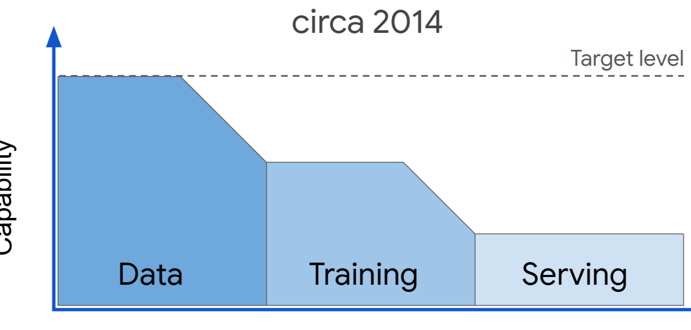
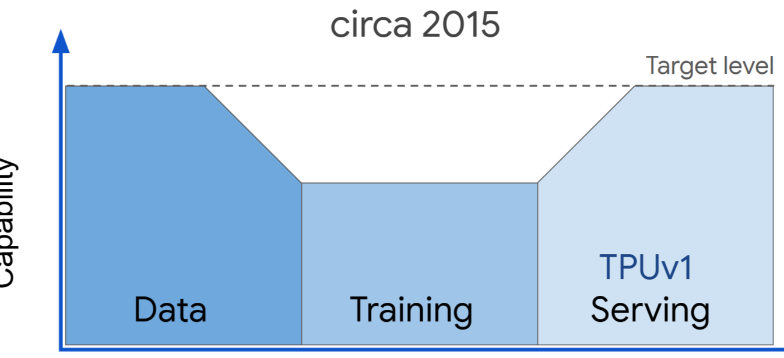
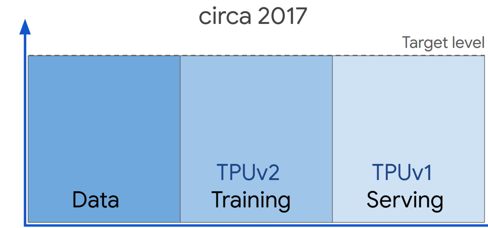

The increase in training demand introduced a series of challenges: compared to inference workloads, training needs more types of compute operators, including backprop, transpose, derivatives, etc.; additionally, it needs more memory to store backprop data; support for a broader range of operand precisions is also necessary; and because training algorithms and optimizers change frequently, flexibility becomes more important. To train larger models, further improvements are needed in scale up rather than scale out, because the latter is already hard to improve further.

To meet these requirements, Google made multiple improvements on the original TPUv1 architecture, eventually forming TPUv2 and TPUv3.

**TPUv1**

The components of TPUv1 are shown below:

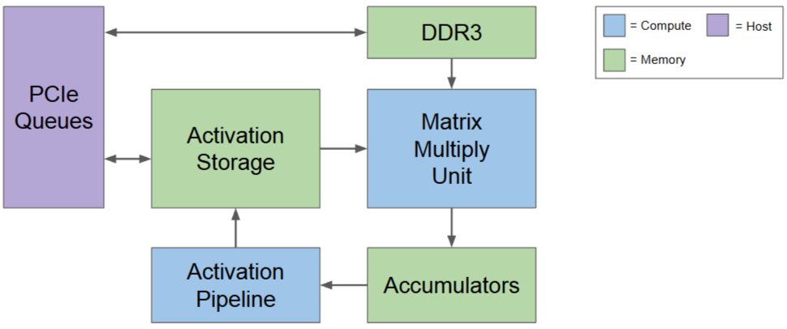
The following three figures show the Vector-processing changes in **TPUv2**: \
Activation storage and accumulators were replaced by Vector Memory, and the Activation Pipeline was replaced by a Vector Unit, enabling a broader set of vector operations and faster, more flexible access.

1. TPUv2 put Activation Storage and Accumulators together, introducing “Single vector memory instead of buffers between fixed function units.” This means the vector memory was designed to provide more flexible and efficient data storage and access for the vector unit.

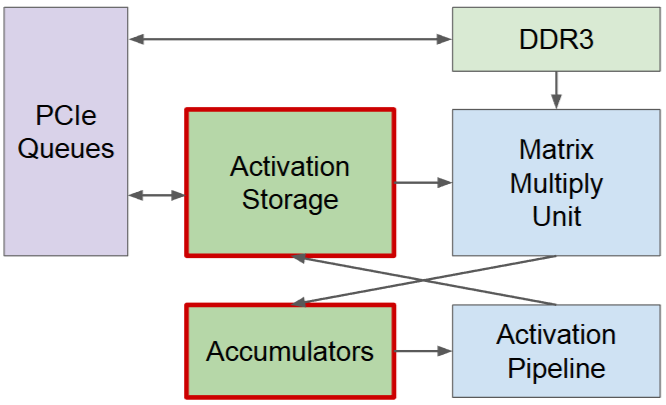

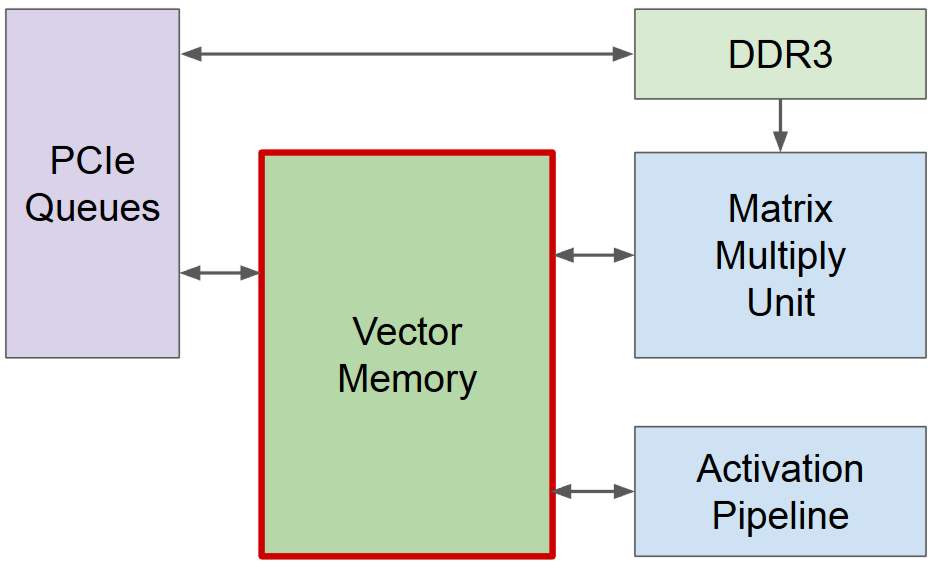
2. TPUv2 introduced the Vector Unit to replace the Activation Pipeline. First, this is because the training phase requires broad use of vector operands, such as activation functions, normalization, data preprocessing, and vector operations that may appear in compute graphs. Second, to increase programmability, the fixed-function activation pipeline was removed so developers could support more kinds of vector operations. This is also the reason for the Vector Memory system: to match this more general vector unit, a more flexible memory subsystem is needed. Vector Memory was designed for this.

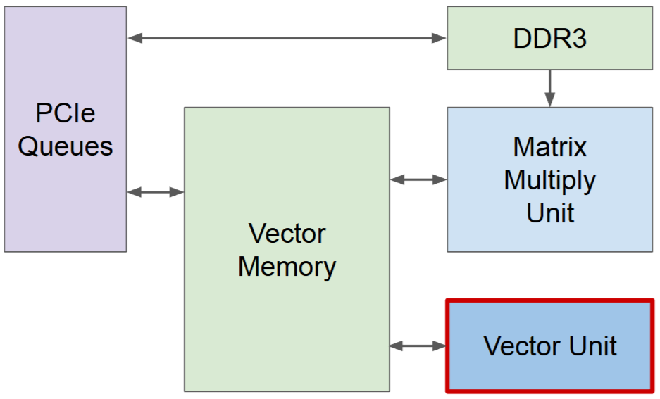
In terms of changes to the Matrix Multiply Unit at the architectural level, the original MXU pulled data directly from storage units, and the data path was modified to offload data directly from the Vector Unit. \
In TPUv1, the MXU mainly handled matrix operations. Its output was passed to the Accumulators and Activation Pipeline, and finally stored in Activation Storage for later use. This linkage is a producer-consumer relationship, mainly for storing and retrieving data, but it is not optimal in operator flexibility or runtime efficiency. \
In TPUv2, the MXU data path was modified to offload data directly from the Vector Unit, **connecting as a coprocessor to the vector unit**. This design has several benefits:
1. Working in coordination with the Vector Unit: MXU results can be handed directly to the Vector Unit for post-processing, and Vector Unit results can be fed into MXU for computation. This tight collaboration allows them to complete their work within a single instruction cycle.
2. The general Vector Unit can support more general activation functions and matrix-vector multiply operations.
3. It reduces unnecessary memory reads/writes between the Vector Unit and MXU, improving data throughput.
4. Compiler-friendly: TPUv2 adopts a VLIW (Very Long Instruction Word) architecture. In this architecture, the compiler packs multiple independent instructions into one VLIW instruction to execute in parallel. The compiler can schedule the Vector Unit and MXU work and pack them into one VLIW instruction, improving overall execution efficiency. (TODO: this needs verification)

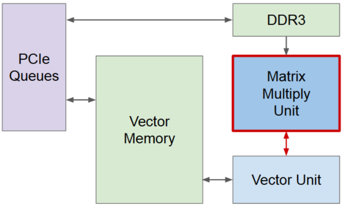
Loading read-only parameters into MXU as done in inference is not suitable for training. Training needs to write these parameters, and it needs large buffers to store temporary variables for each step. Therefore, DDR3 was moved behind the vector memory, forming a memory hierarchy. In later versions, HBM replaced DDR3. HBM’s bandwidth increased by 20x, directly addressing memory capacity and bandwidth issues for ML training. This design also made the storage system more flexible, able to support data movement for complex operators.

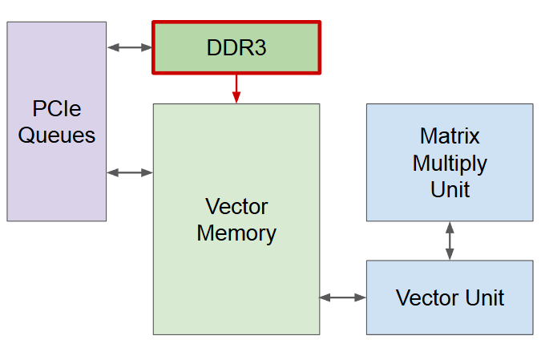

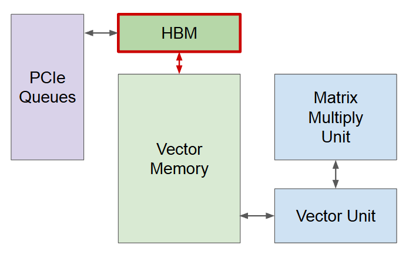

TPUv2 introduced a custom inter-chip interconnect (InterChip Interconnect, ICI/片间互联) module, shifting the chip from scale up to scale out. The interconnect directly connects to HBM and Vector Memory, enabling higher bandwidth and lower latency for inter-chip communication.

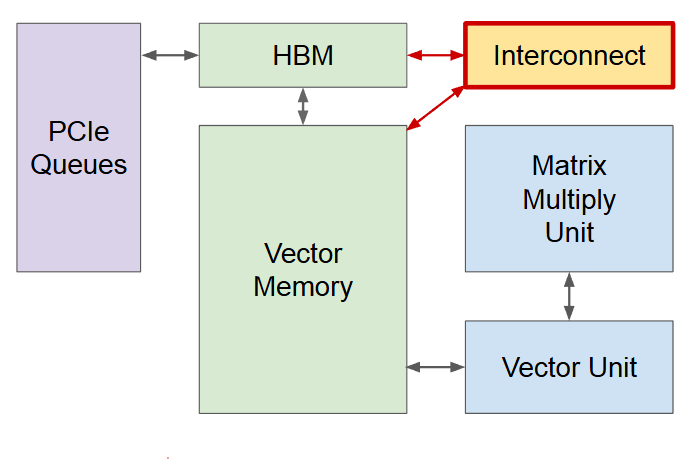
From here we can see the Interconnect module can also serve as interconnect among multiple on-chip cores, forming a huge distributed compute network so Google can train extremely large and complex ML models.
TPUv2 uses a dual-core configuration because building a larger single core would greatly increase wire delay, while a dual-core configuration strikes an ideal balance between reasonable pipeline latency and additional single-chip compute capability. More cores are not used for ease-of-programming considerations.
>  " We took advantage of training fundamentally being a big-data problem. "

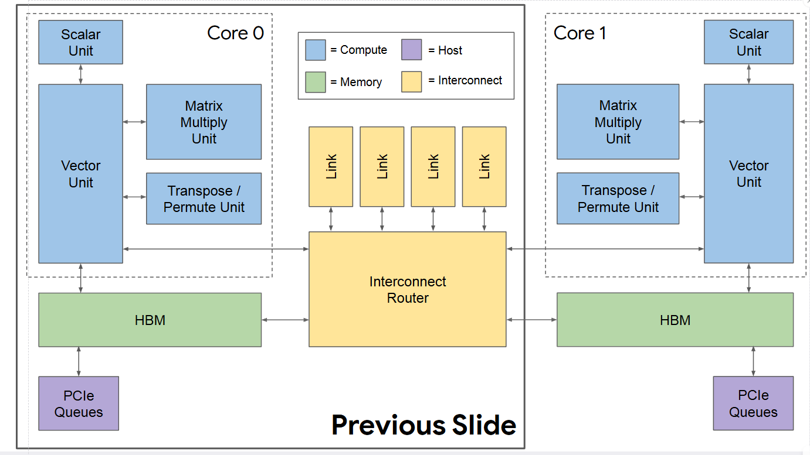

Changes from TPUv2 to TPUv3 were mainly incremental improvements based on “marginal effects.”

Compute capability doubled: MXU count doubled, doubling max FLOPs/s.
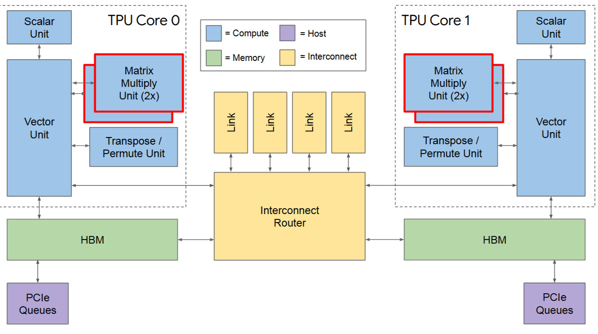
Clock frequency increased: from 700 MHz to 940 MHz, a 30% performance increase.
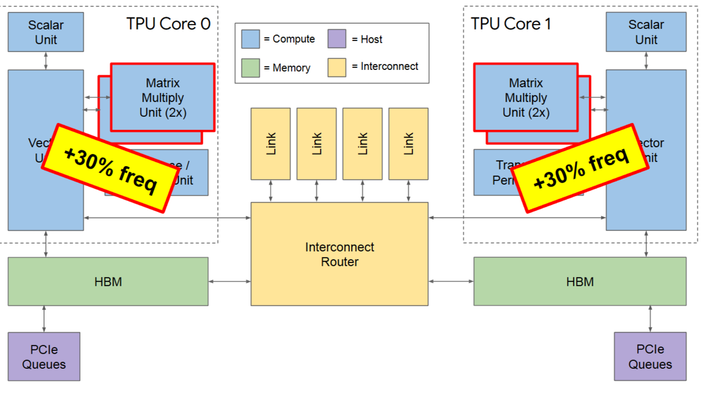
HBM performance and capacity improved: HBM bandwidth increased by 30%, capacity doubled, supporting larger models and batch sizes.
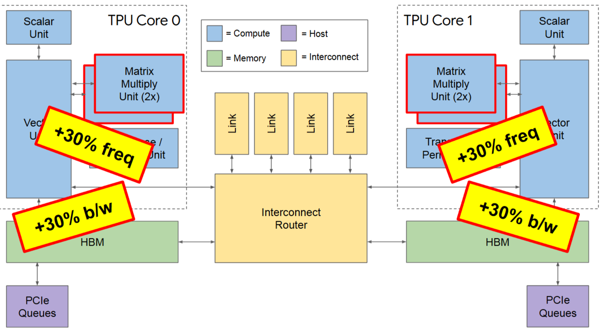
Interconnect bandwidth improved: link bandwidth increased by 30% to 650 Gbps/link.

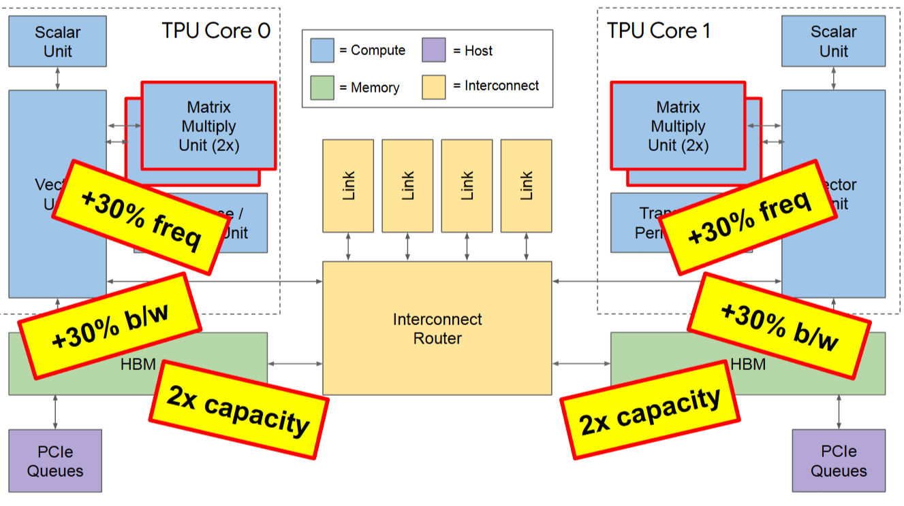
System scale expanded: maximum system size grew from TPUv2’s 256 chips to 1024 chips.
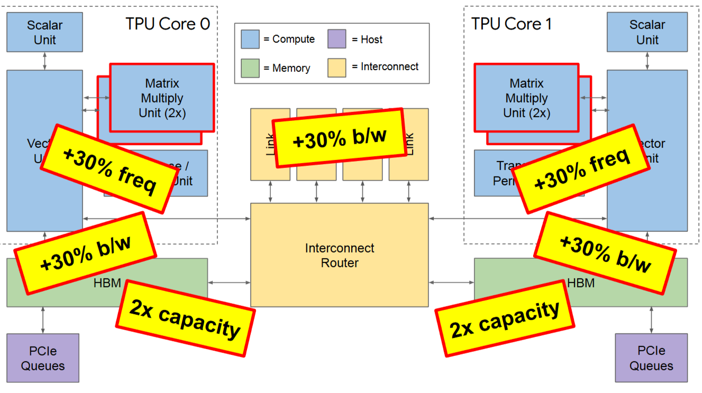
The figure below compares the performance of TPUv2 and TPUv3 using the Roofline model and against NVIDIA’s then-latest V100 GPU.
- TPUv3 has a smaller area and a less-advanced process node, yet in MLPerf 0.6 benchmarks, TPUv3 single-chip performance is on par with NVIDIA V100.
- TPUv3’s peak compute performance improved 2.7x over TPUv2, while memory bandwidth, ICI bandwidth, and clock frequency only improved 1.3x, indicating high MXU utilization with small area contribution.
- TPUv3 supercomputers running Google applications have a GigaFLOPs/Watt efficiency 50x higher than general-purpose supercomputers running Linpack.
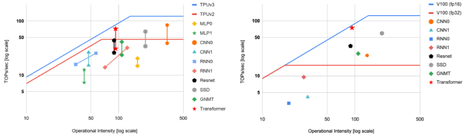

## Reference
[1] [Google’s Training Chips Revealed:TPUv2 and TPUv3](https://www.hc32.hotchips.org/assets/program/conference/day2/HotChips2020_ML_Training_Google_Norrie_Patil.v01.pdf)\
[2] [The Design Process for Google’s Training Chips: TPUv2 and TPUv3](https://gwern.net/doc/ai/scaling/hardware/2021-norrie.pdf)
